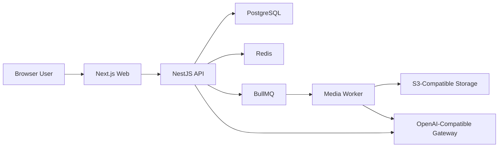

# AITRPG System Design

## Runtime Overview

## Services

- `web`: App Router frontend for auth, campaigns, characters, live rooms, and post-session studio
- `api`: REST and WebSocket backend, auth, room orchestration, ledger, and media job APIs
- `worker`: BullMQ processors for portrait, illustration, novel, and video jobs

## Domain Modules

- `auth`: email code challenge and JWT session issue
- `campaigns`: campaign lifecycle and DM ownership
- `characters`: player characters, AI party members, portrait assets
- `rooms`: session state, room participants, live event submission
- `sharing`: room share links, password checks, and spectator access
- `spectators`: spectator comments and moderation-safe read-only viewing
- `ledger`: normalized story events
- `media`: jobs and assets
- `providers`: environment-backed AI provider selection

## Design Constraints

- Provider-specific model names live in environment variables
- Frontend never receives provider secrets
- Story events are append-only records; presentation can derive timelines and summaries later
- Spectator comments are stored separately from the main story event stream
- Video generation is job-based and may surface unsupported-provider errors without breaking the rest of the session

